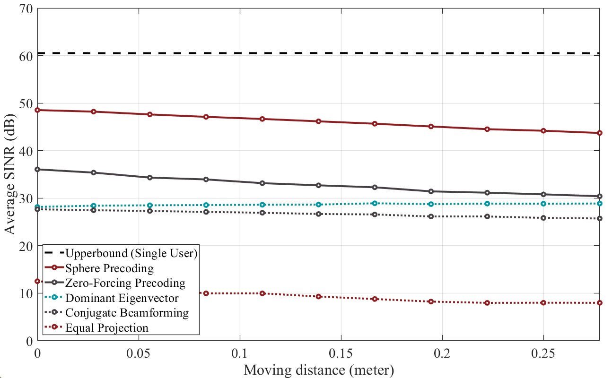
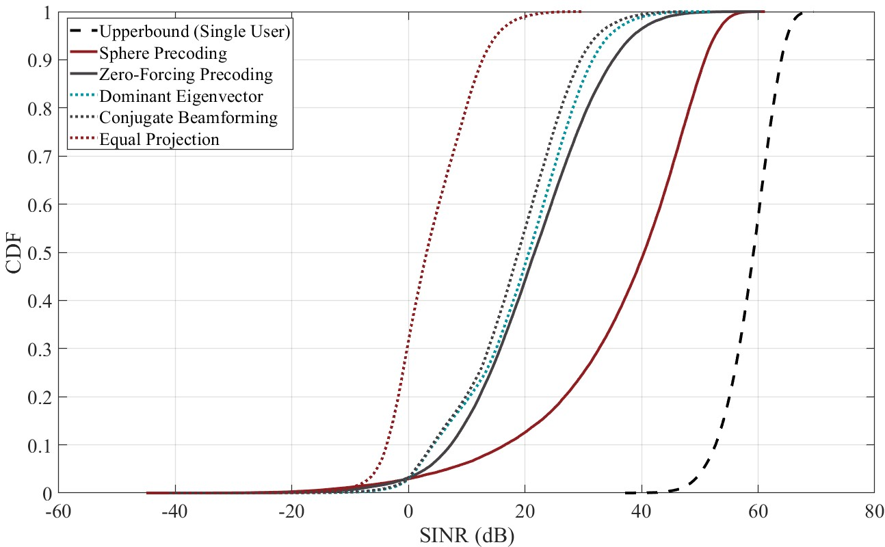
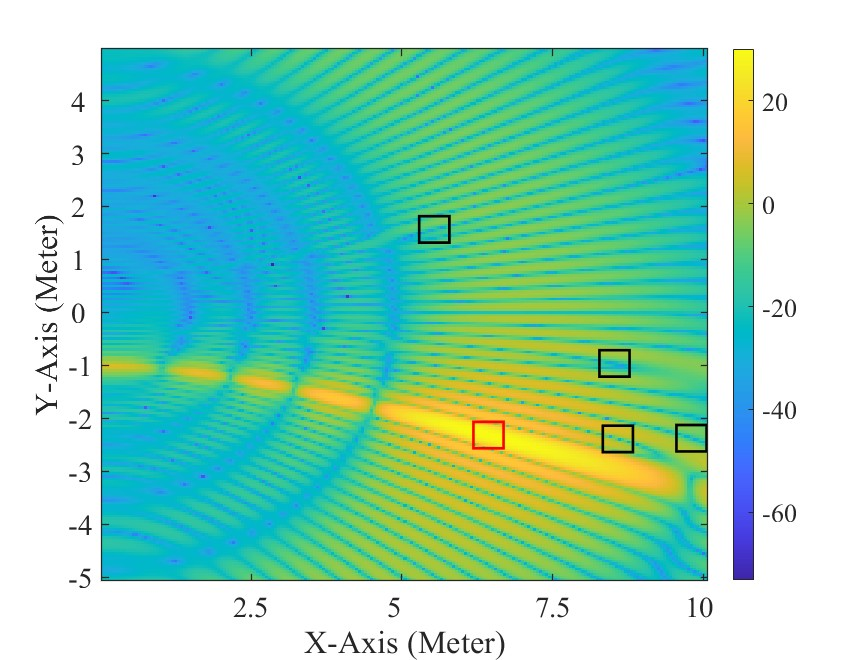
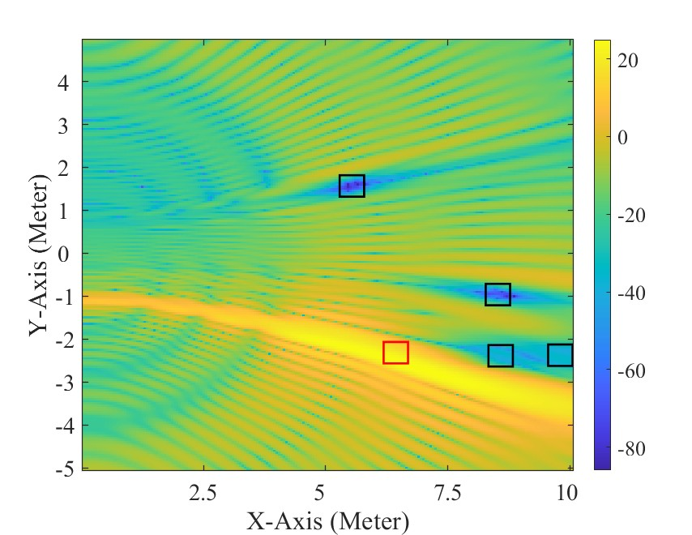

# Sphere Precoding for Robust Near-Field Communications
This is a Matlab code package related to the following article: "[Sphere Precoding for Robust Near-Field Communications](https://arxiv.org/abs/2503.06756)", arXiv preprint arXiv:2503.06756, 2025.

# Abstract of the Article

Near-field communication with large antenna arrays promises significant beamforming and multiplexing gains. These communication links, however, are very sensitive to user mobility as any small change in the user position may suddenly drop the signal power. This leads to critical challenges for the robustness of these near-field communication systems. In this paper, we propose <i>sphere precoding</i>, which is a robust precoding design to address user mobility in near-field communications. To gain insights into the spatial correlation of near-field channels, we extend the one-ring channel model to what we call one-sphere channel model and derive the channel covariance considering user mobility. Based on the one-sphere channel model, a robust precoding design problem is defined to optimize the minimum signal-to-interference-plus-noise ratio (SINR) satisfaction probability among mobile users. By utilizing the eigen structure of channel covariance, we further design a relaxed convex problem to approximate the solution of the original non-convex problem. The low-complexity solution effectively shapes a sphere that maintains the signal power for the target user and also nulls its interference within spheres around the other users. Simulation results highlight the efficacy of the proposed solution in achieving robust precoding yet high achievable rates in near-field communication systems.

# Code Package Content

**Environment**
- Matlab R2022b
- CVX 2.2.2
- Mosek 11.0

**Simulation setup**
- The simulation parameters can be set in `sim_params.m` file.

**Generate user distributions**
- Run `generate_user_distribution.m` to generate the user coordinates.

**Precoding design**
- Run `compute_precoding_vector.m` to generate the precoding vectors.

**Performance evaluation**
- Run `evaluate.m` to evaluate the proposed and benchmark methods.

**Plot results**
- Run `merge.m` to combine the results of all user distributions.
- Run `plot_results.m` to plot the SINR performance.

- Run `plot_bf_gain.m` to plot the beamforming pattern.

If you have any questions regarding the code, please contact [Hao Luo](mailto:h.luo@asu.edu).

# License and Referencing
 This code package is licensed under a [Creative Commons Attribution-NonCommercial-ShareAlike 4.0 International License](https://creativecommons.org/licenses/by-nc-sa/4.0/).

If you in any way use this code for research that results in publications, please cite our original article:

> H. Luo, Y. Zhang, A. Alkhateeb, "Sphere Precoding for Robust Near-Field Communications," arXiv preprint arXiv:2503.06756, 2025.
